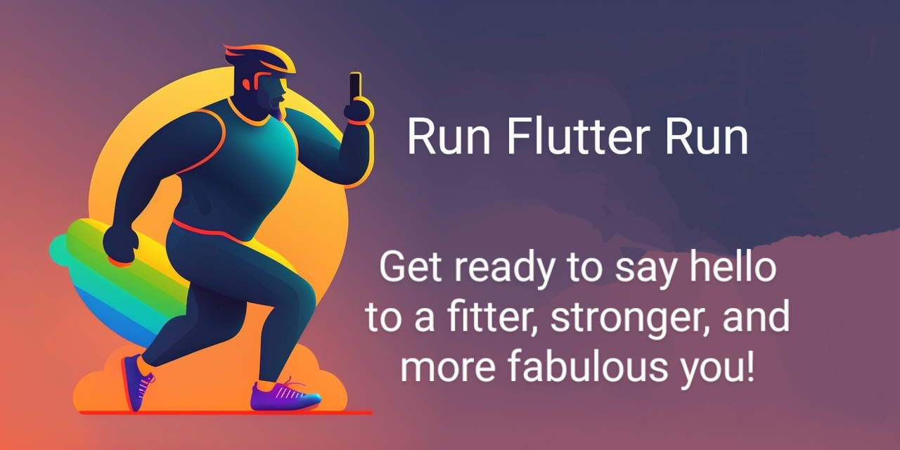

# Run Flutter Run

A clone of the Runtastic mobile app

## Functionalities

Register your runs with this app.
You will be able to see the map of your run, 
It will tell the distance and speed every km and at the end of the run.
You will be able to see a list of all your activities afterward with all the details you add at the sum up after your run

## Getting Started

### Prerequisites

You need flutter

### How to run

```
flutter pub get
flutter gen-l10n
flutter run
```

## Some screenshots of the application

### New Activity

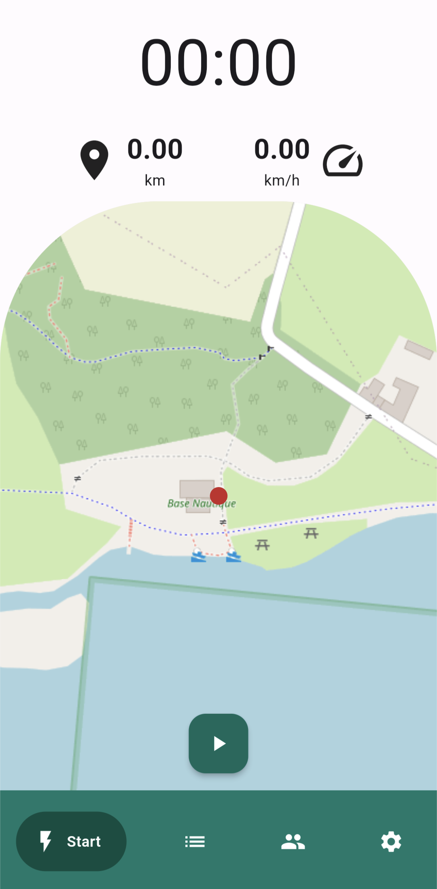 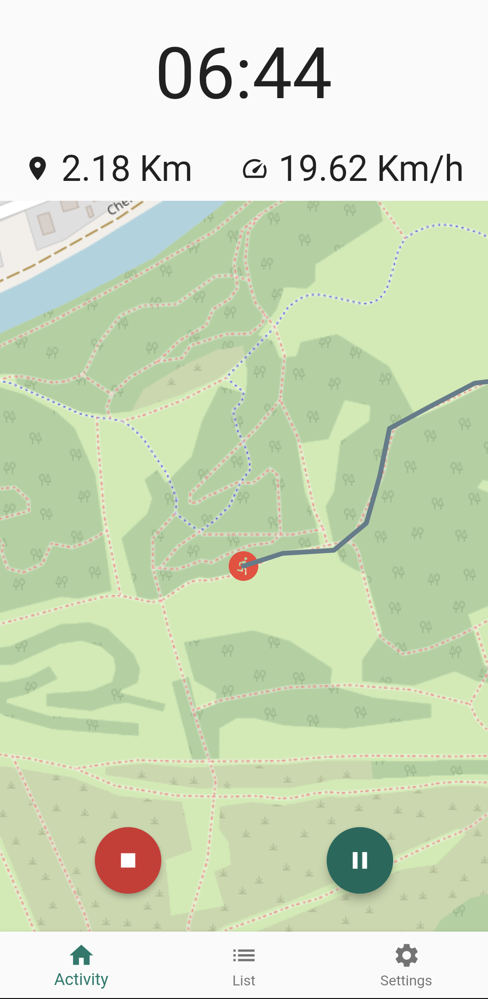 

### Activity list

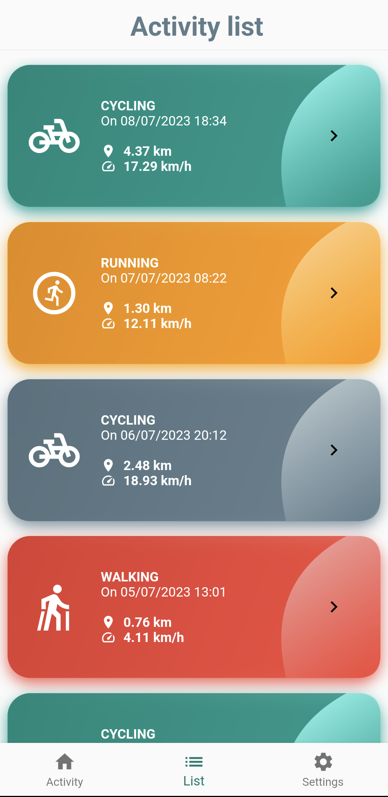 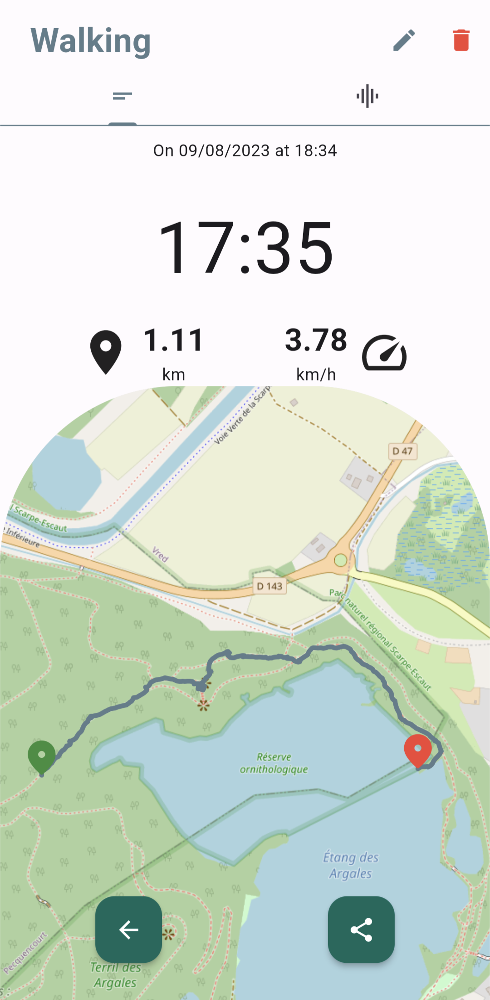 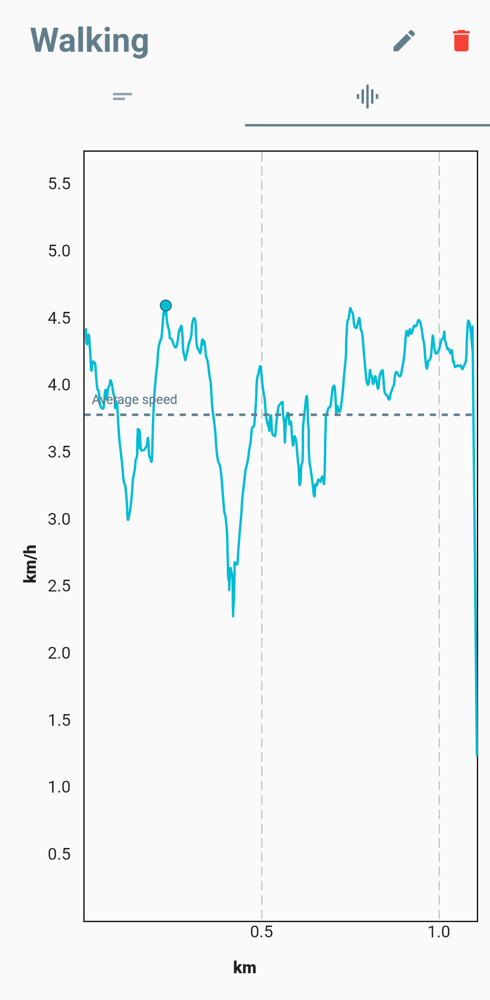 

### Community

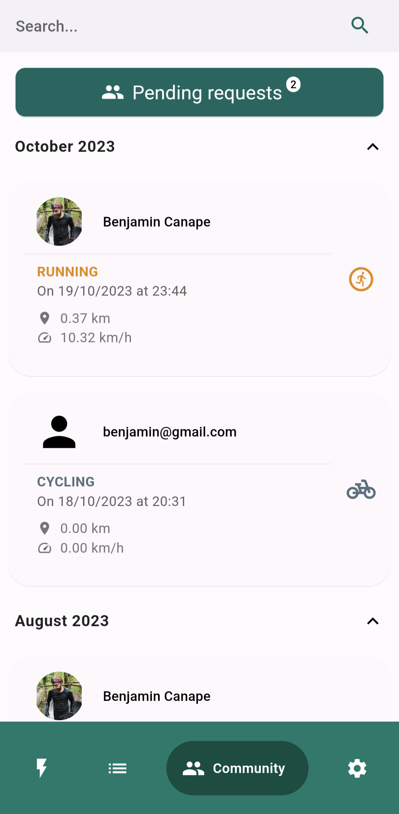 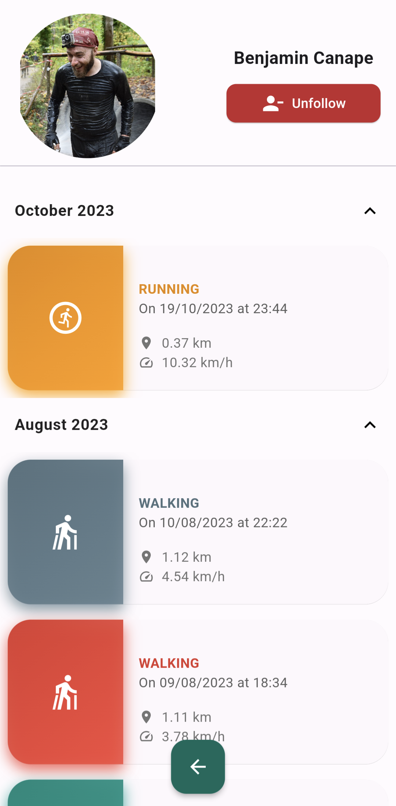

### Settings

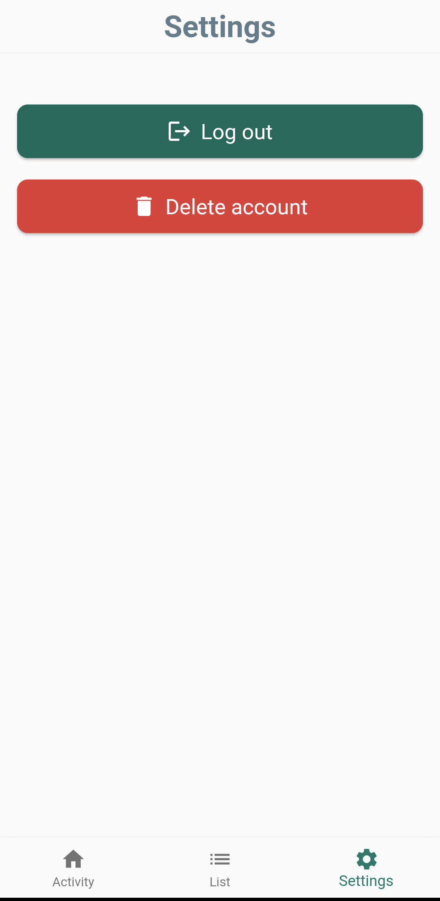

### Login and registration

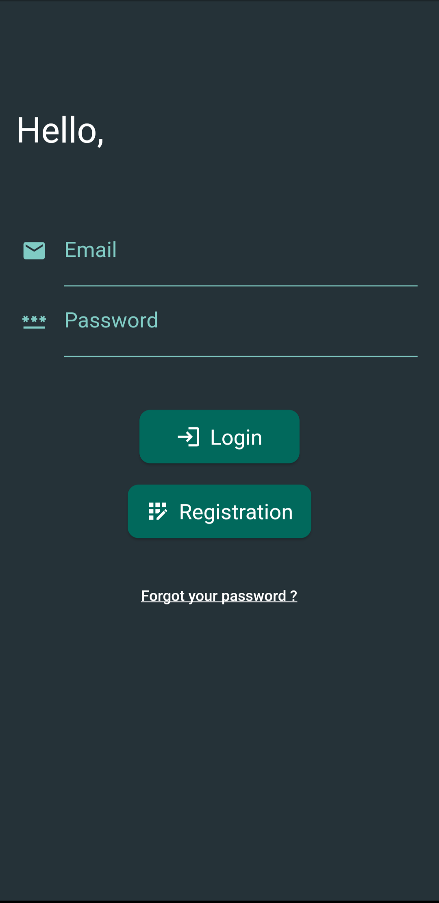 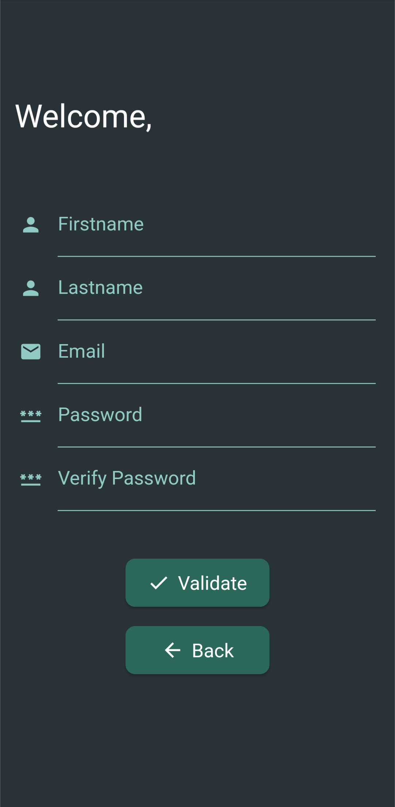
