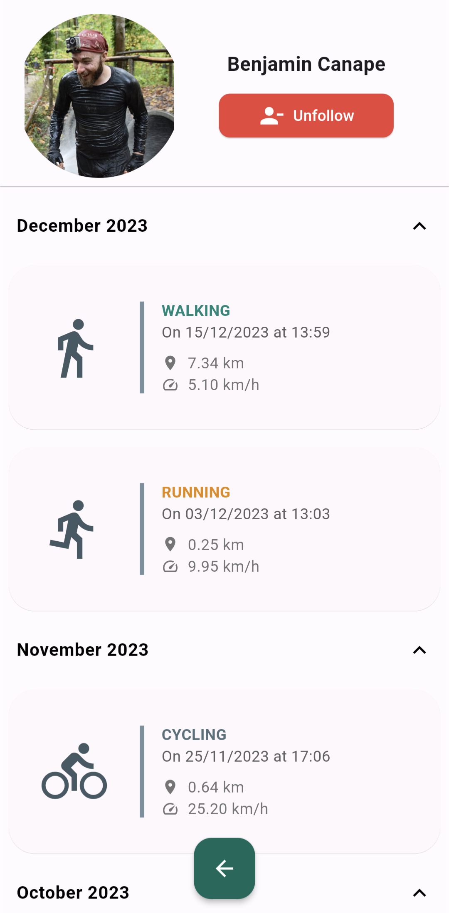
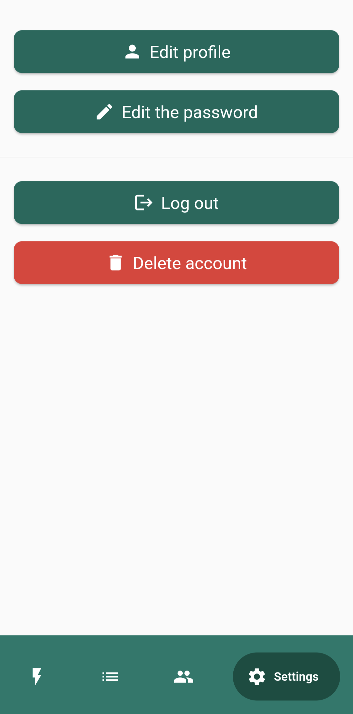

# Run Flutter Run

A clone of the Runtastic or Strava mobile app

## Fork it, add new functionnalities, please don't hesitate

If you want to play with the project or add new functionnalities, you can fork this current repository and the backend one (https://github.com/BenjaminCanape/RunBackEndRun) and do what you want with it, and if it's awesome maybe propose it in a Pull request here. 

I would be happy to see all your ideas and improvments.

And if the code helped you and you want to thank me for this, you can buy me a coffee: </br>

<a href="https://buymeacoffee.com/benjamincanape" target="_blank"></a>

## Functionalities

Record your running, walking, and cycling sessions with session tracking through voice synthesis and a map updated with real-time location.

Users can also view their previous sessions and follow other users to see, like and comment their activities.

## Getting Started

### Prerequisites

You need flutter (The best is to use the version 3.22 and above)

### How to run

```
flutter pub get
flutter gen-l10n
flutter run
```

## Some screenshots of the application

### New Activity

  

### Activity list

   

### Community

  

### Settings

 

### Login and registration

 
