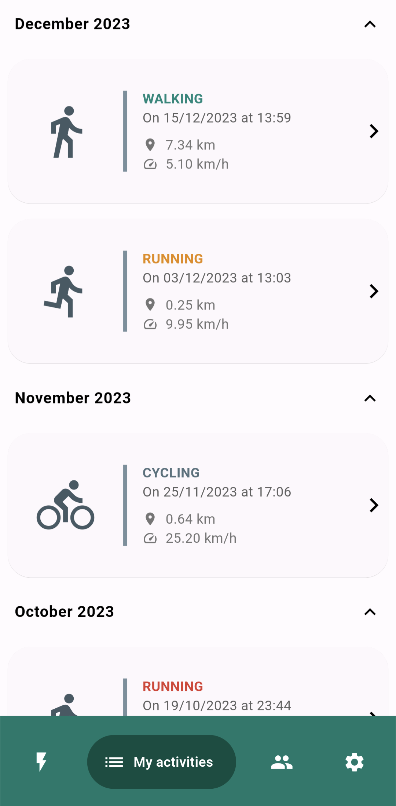
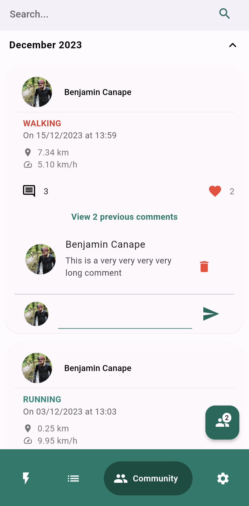
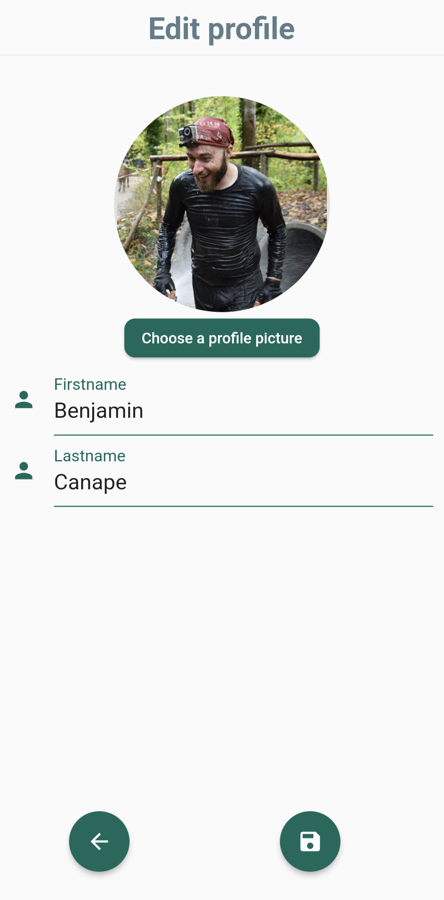

# Run Flutter Run

A clone of the Runtastic mobile app

## Functionalities

Record your running, walking, and cycling sessions with session tracking through voice synthesis and a map updated with real-time location.

Users can also view their previous sessions and follow other users to see, like and comment their activities.

## Getting Started

### Prerequisites

You need flutter (The best is to use the version 3.16 and above)

### How to run

```
flutter pub get
flutter gen-l10n
flutter run
```

## Some screenshots of the application

### New Activity

  

### Activity list

   

### Community

  

### Settings

 

### Login and registration

 
